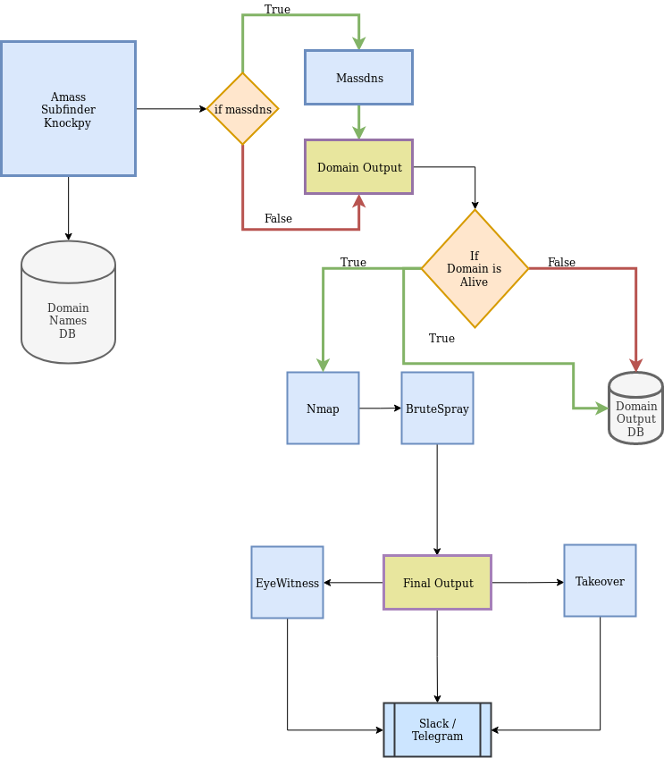
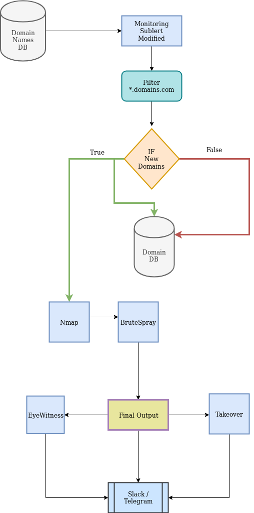
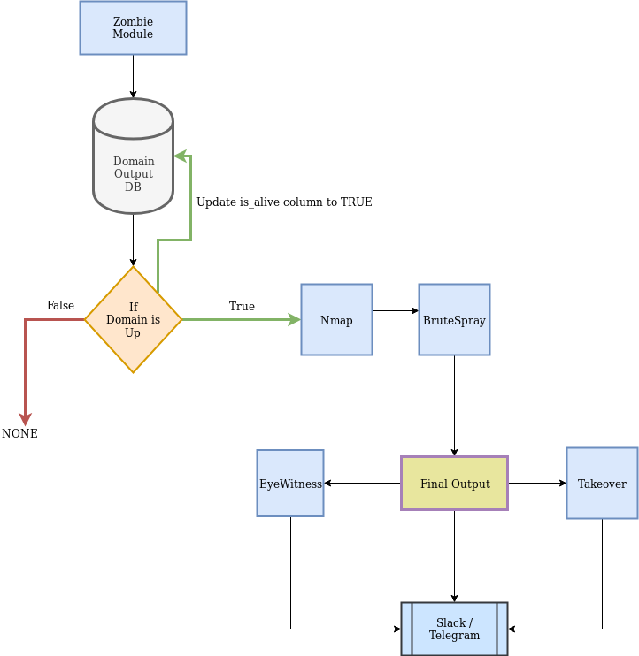
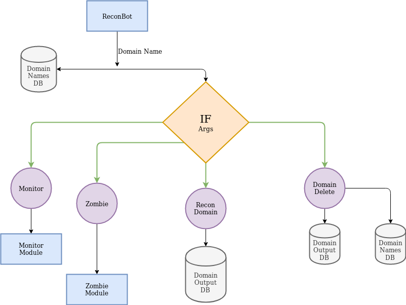

# ReconBot V2
## Workflow

### ReconBot

### Monitor Module
Monitor Module fetches domain name from database and checks if a new domain is available using crt.sh and does the nessary operations.

### Zombie Module

Generally domains extracted from crt.sh maynot resolve using Zombie module it periodically checks if the domain names in the database are alive and if it is alive does the nessary actions

### Database Model

Usage

    python recon.py --init 
    #Creates nessary database & Sends sample Slack message

    python recon.py -d example.com
    #Starting Recon
    
    python recon.py --monitor
    #Starting Monitor Module which fetches domain names from crt.sh (SET THIS MODULE AS CRON )
    
    python recon.py --zombie
    #Wake up the Zombie and awaken the dead (SET THIS MODULE AS CRON )
   Slack Bot Token is needed

Todo

 - [ ] Multi Threading
 - [ ] Reliable Subdomain Takeover Scanner
 - [ ] Formatted Slack Output
 - [ ] BandWidth Optimization
 - [x] Database Schema and Development

#please note that this is a project still in progress some modules may not work as according..Also do contribute to this repo....

PEACE

 
